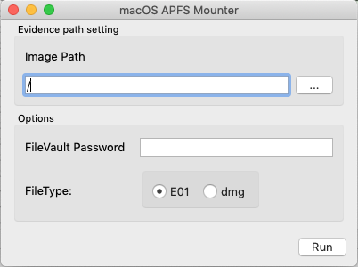

[](https://github.com/Recruit-CSIRT/macApfsMounter/releases/latest)
[](https://github.com/Recruit-CSIRT/macApfsMounter/blob/master/LICENSE)

# macApfsMounter

A small tool to easily mount APFS image on macOS.


## Abstract

`macApfsMounter` is a small tool to mount E01(ewf) image of APFS container level on macOS for forensics.  
This tool supports dmg image file of APFS filesystem too.
So for example, you can mount the dmg file created by [macOSTriageTool](https://github.com/Recruit-CSIRT/macOSTriageTool).  
If the image file is encrypted by FileVault2, then this tool unlocks the image file using the password.     

## Features
- GUI and CLI
    - Offer GUI and CLI version.
- FileVault2
    - Unlock FileVault2 if password set.
- E01 and DMG
    - Support E01 file format and DMG file format.
    - Also support separated E01 format.
- Safety mount
    - This tool mount an image with readonly, noexec and noowners.
    
## Quick Start

### Requirement 

- osxfuse and xmount
    - for cli 
    ```
    $ brew tap homebrew/cask 
    $ brew cask install osxfuse
    $ brew install xmount
    ```
    - for gui
    ```
    1. Download and install the latest OSXFuse. 
       Url: https://osxfuse.github.io/
            
    2. Download and install xmount.
       Url: https://files.pinguin.lu/xmount-0.7.6.pkg
    ```
      
### CLI
```
Usage of ./amtr:
  -i string
        set the img path.
  -p string
        set the password of FileVault2 on evidence.
  -t string
        select the file type. ewf(e01 file) or dmg. (default "ewf")
  -u    unmount option. only ewf and raw
```
Note: unmount option is a little buggy. 

### GUI
Set the image file path and click Run button.



- Image Path
    - Set an image file path.
    - You can also choose a dmg file, if you check the dmg file type option.
- Options
    - FileVault Password
        - Enter the password of the evidence.
    - FileType
        - Check if you want to mount the dmg file. Default is ewf (e01 file type).

### Tips
This tool supports separated EWF files like E01, E02, E03 and so on.  
Please input single file in such situation too.  
Note: only support .E*(E01 ~ EFF) and not support further split like .F*, .G* etc.

```
% ls -la
total 455699200
drwxrwxrwx  1 alice  staff      131072  3  9 14:35 .
drwxrwxrwx  1 alice  staff      131072  3  9 14:35 ..
-rwxrwxrwx  1 alice  staff         875  3  9 16:10 Acquisition Log.txt
-rwxrwxrwx  1 alice  staff          65  3  9 16:10 Device.2.log
-rwxrwxrwx  1 alice  staff         639  3  9 16:10 Device.log
-rwxrwxrwx  1 alice  staff     1893629  3  9 14:35 IORegInfo.txt
-rwxrwxrwx  1 alice  staff       89088  3  9 16:10 MacQTracking-202003090071048.sdb
-rwxrwxrwx  1 alice  staff  1073716807  3  9 16:10 R001.E01
-rwxrwxrwx  1 alice  staff  1073711793  3  9 16:10 R001.E02
-rwxrwxrwx  1 alice  staff  1073717878  3  9 16:10 R001.E03
-rwxrwxrwx  1 alice  staff  1073734754  3  9 16:10 R001.E04

% sudo ./amtr -i R001.E01
```

## Compile

### CLI
```
$ make cli
```

### GUI
```
$ brew install qt
$ export QT_HOMEBREW=true
$ export GO111MODULE=off; xcode-select --install; go get -v github.com/therecipe/qt/cmd/... && $(go env GOPATH)/bin/qtsetup -test=false
$ make gui
```

## License
This repository is available under the GNU General Public License v3.0

## Author
moniik

