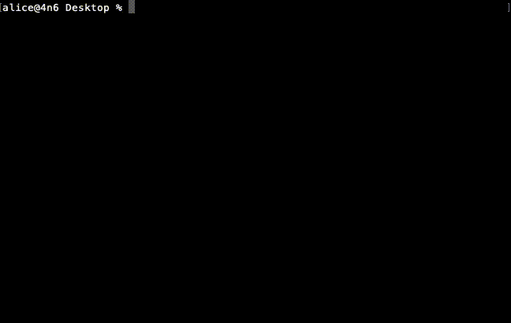
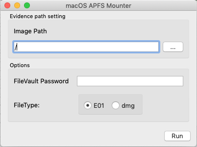

[](https://github.com/Recruit-CSIRT/macApfsMounter/releases/latest)
[](https://github.com/Recruit-CSIRT/macApfsMounter/blob/master/LICENSE)

# macApfsMounter




## Abstract
`macApfsMounter` は、macOS上でAPFSコンテナレベルで取得したE01(ewf)ファイルをマウントするためのツールです。  
APFSのファイルシステムで作成したdmg形式のファイルのマウントもサポートしています。
このため、[macOSTriageTool](https://github.com/Recruit-CSIRT/macOSTriageTool)で取得したdmgファイルをインプットとしてマウントすることも可能です。  
FileVault2での暗号化がされている場合でも、パスワードを入力することでロックを解除し、マウントすることができます。

## 特徴
- GUI と CLI
    - GUIとCLIの両方のバージョンがあります。
- FileVault2対応
    - パスワードがセットされている場合、FileVault2のロックを解除してマウントします。
- E01 と DMG に対応
    - E01とdmg形式のディスクイメージに対応しています。    
- 書き込みをしないようにマウント
    - readonly、noexec、noownersでマウントします。

## クイックスタート

### 環境 

- 実行にはxmountとOSXFuseが必要です。
    - コマンドプロンプトからインストールする方法
    ```
    $ brew tap homebrew/cask 
    $ brew cask install osxfuse
    $ brew install xmount
    ```
    - パッケージなどからインストールする方法
    ```
    1. OSXFuseをダウンロードし、インストールします。 
       Url: https://osxfuse.github.io/
            
    2. xmountをダウンロードし、インストールします。
       Url: https://files.pinguin.lu/xmount-0.7.6.pkg
    ```
  
### CLI
```
Usage of ./amtr:
  -i string
        set the img path.
  -p string
        set the password of FileVault2 on evidence.
  -t string
        select the file type. ewf(e01 file) or dmg. (default "ewf")
  -u    unmount option. only ewf and raw
```

### GUI
イメージファイルのパスを設定し、Runボタンをクリックすることで実行できます。



- Image Path
    - イメージファイルを指定してください。
    - FileTypeでdmgを選択している場合、dmgファイルを選択できます。
- Options
    - FileVault Password
        - FileVault2のロックを解除するためのパスワードを入力してください。
    - FileType
        - イメージファイルがdmg形式の場合、チェックをしてください。デフォルトはewfフォーマット(e01フォーマット)です。
        
### Tips
このツールは分割されたE01ファイル形式(E01、E02、E03....)のマウントをサポートしています。  
その場合はひとつのファイルを指定すれば、全てのEXXファイルをインプットとして動作します。  
`.E*`のみをサポートしているため、`.F*`などの分割には対応していません。

```
% ls -la
total 455699200
drwxrwxrwx  1 alice  staff      131072  3  9 14:35 .
drwxrwxrwx  1 alice  staff      131072  3  9 14:35 ..
-rwxrwxrwx  1 alice  staff         875  3  9 16:10 Acquisition Log.txt
-rwxrwxrwx  1 alice  staff          65  3  9 16:10 Device.2.log
-rwxrwxrwx  1 alice  staff         639  3  9 16:10 Device.log
-rwxrwxrwx  1 alice  staff     1893629  3  9 14:35 IORegInfo.txt
-rwxrwxrwx  1 alice  staff       89088  3  9 16:10 MacQTracking-202003090071048.sdb
-rwxrwxrwx  1 alice  staff  1073716807  3  9 16:10 R001.E01
-rwxrwxrwx  1 alice  staff  1073711793  3  9 16:10 R001.E02
-rwxrwxrwx  1 alice  staff  1073717878  3  9 16:10 R001.E03
-rwxrwxrwx  1 alice  staff  1073734754  3  9 16:10 R001.E04

% sudo ./amtr -i R001.E01
```

## Compile

### CLI
```
$ make cli
```

### GUI
```
$ brew install qt
$ export QT_HOMEBREW=true
$ export GO111MODULE=off; xcode-select --install; go get -v github.com/therecipe/qt/cmd/... && $(go env GOPATH)/bin/qtsetup -test=false
$ make gui
```

## License
This repository is available under the GNU General Public License v3.0

## Author
moniik

